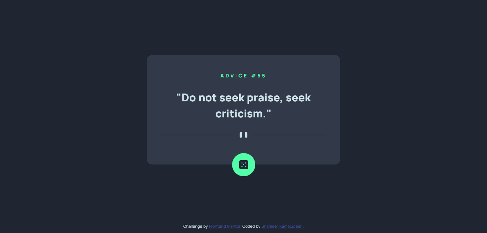

# Frontend Mentor - Advice generator app solution

This is a solution to the [Advice generator app challenge on Frontend Mentor](https://www.frontendmentor.io/challenges/advice-generator-app-QdUG-13db). Frontend Mentor challenges help you improve your coding skills by building realistic projects.

## Table of contents

- [Overview](#overview)
  - [The challenge](#the-challenge)
  - [Screenshot](#screenshot)
  - [Links](#links)
- [My process](#my-process)
  - [Built with](#built-with)
  - [What I learned](#what-i-learned)
  - [Useful resources](#useful-resources)
- [Author](#author)

## Overview

The challenge helps a hand on experience with the very basic API. This is the first API usage from the Frontend mentor if you are following the challenges in order based on the difficulty and the team took care to make very basic usage of the API in this challenge.

### The challenge

Users should be able to:

- View the optimal layout for the component depending on their device's screen size
- View random advice from each button click
- Fetch advice from a third party API

### Screenshot

### Links

- Solution URL: [Click here](https://github.com/shameerkamaludeen/advice-generator-app)
- Live Site URL: [Click here](https://shameerkamaludeen.github.io/advice-generator-app/)

## My process

### Built with

- Semantic HTML5 markup
- Mobile-first workflow
- Third party API

### What I learned

Learned basic usage of third party API and how to implement it in our code.

### Useful resources

- [Third-party APIs](https://developer.mozilla.org/en-US/docs/Learn/JavaScript/Client-side_web_APIs/Third_party_APIs)
- [How to use promises](https://developer.mozilla.org/en-US/docs/Learn/JavaScript/Asynchronous/Promises)

## Author

- Github - [Shameer Kamaludeen](https://github.com/shameerkamaludeen)
- Frontend Mentor - [@shameerkamaludeen](https://www.frontendmentor.io/profile/shameerkamaludeen)
